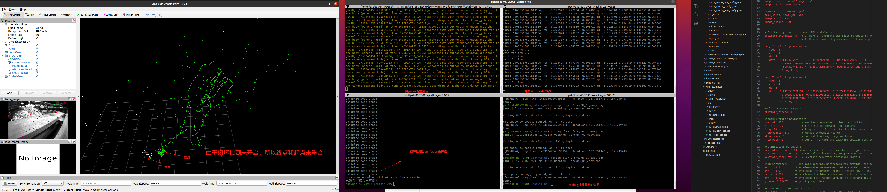
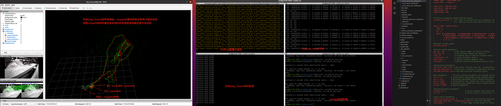
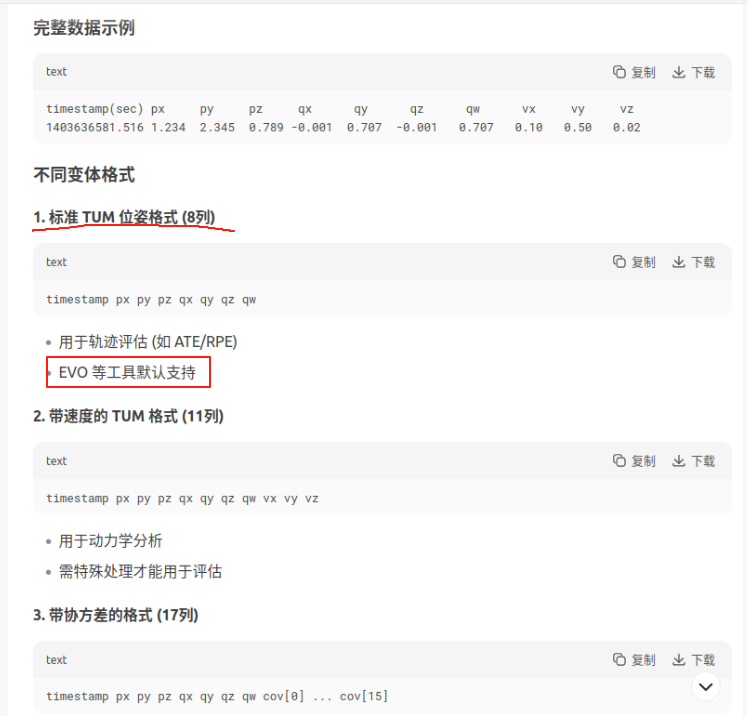
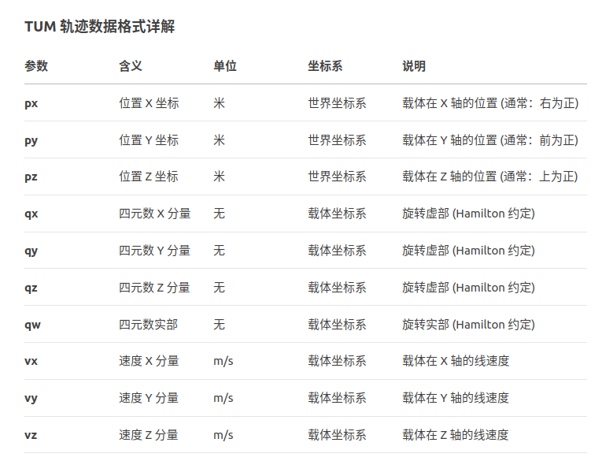
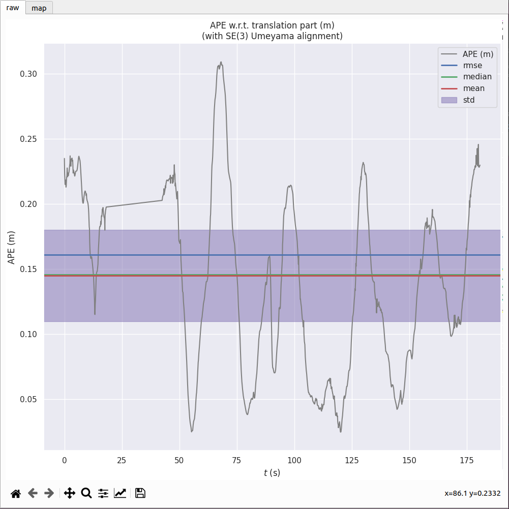
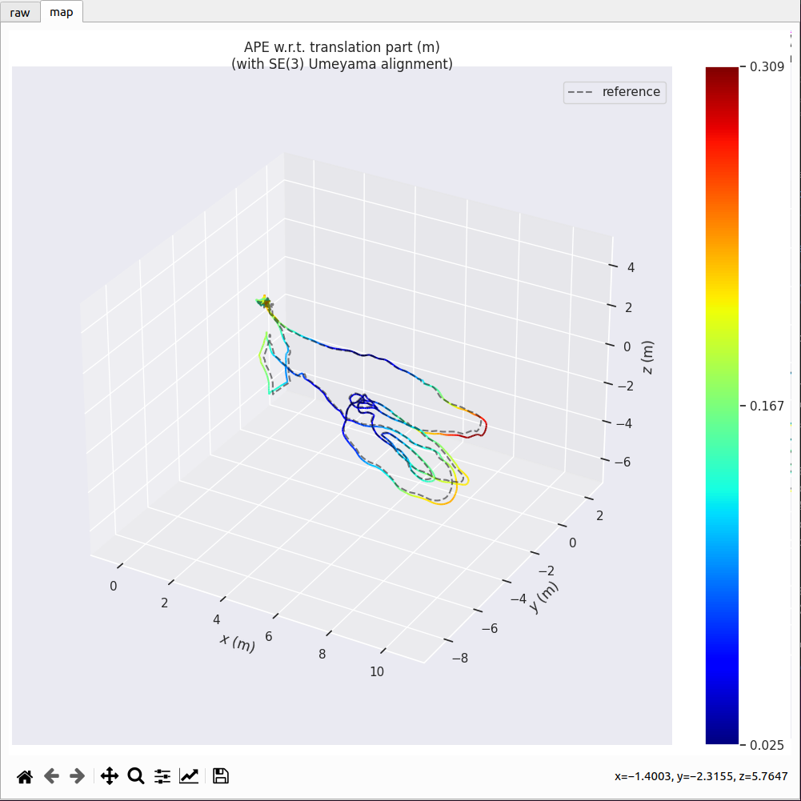
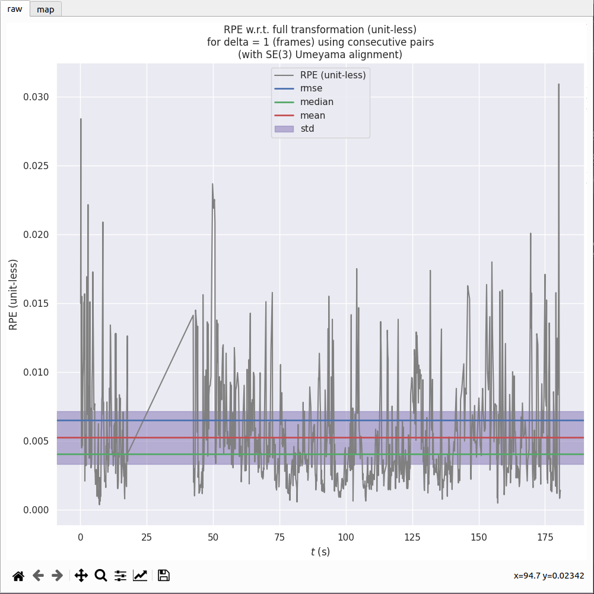
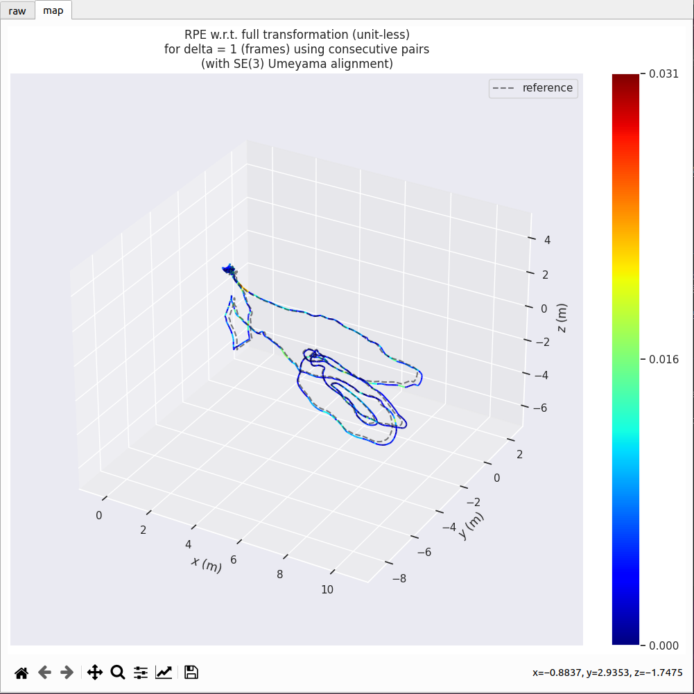

# VINS-Fusion
## An optimization-based multi-sensor state estimator


VINS-Fusion is an optimization-based multi-sensor state estimator, which achieves accurate self-localization for autonomous applications (drones, cars, and AR/VR). VINS-Fusion is an extension of [VINS-Mono](https://github.com/HKUST-Aerial-Robotics/VINS-Mono), which supports multiple visual-inertial sensor types (mono camera + IMU, stereo cameras + IMU, even stereo cameras only). We also show a toy example of fusing VINS with GPS. 
**Features:**
- multiple sensors support (stereo cameras / mono camera+IMU / stereo cameras+IMU)
- online spatial calibration (transformation between camera and IMU)
- online temporal calibration (time offset between camera and IMU)
- visual loop closure


We are the **top** open-sourced stereo algorithm on [KITTI Odometry Benchmark](http://www.cvlibs.net/datasets/kitti/eval_odometry.php) (12.Jan.2019).

**Authors:** [Tong Qin](http://www.qintonguav.com), Shaozu Cao, Jie Pan, [Peiliang Li](https://peiliangli.github.io/), and [Shaojie Shen](http://www.ece.ust.hk/ece.php/profile/facultydetail/eeshaojie) from the [Aerial Robotics Group](http://uav.ust.hk/), [HKUST](https://www.ust.hk/)

**Videos:**

<a href="https://www.youtube.com/embed/1qye82aW7nI" target="_blank"></a>


**Related Paper:** (paper is not exactly same with code)

* **Online Temporal Calibration for Monocular Visual-Inertial Systems**, Tong Qin, Shaojie Shen, IEEE/RSJ International Conference on Intelligent Robots and Systems (IROS, 2018), **best student paper award** [pdf](https://ieeexplore.ieee.org/abstract/document/8593603)

* **VINS-Mono: A Robust and Versatile Monocular Visual-Inertial State Estimator**, Tong Qin, Peiliang Li, Shaojie Shen, IEEE Transactions on Robotics [pdf](https://ieeexplore.ieee.org/document/8421746/?arnumber=8421746&source=authoralert) 


*If you use VINS-Fusion for your academic research, please cite our related papers. [bib](https://github.com/HKUST-Aerial-Robotics/VINS-Fusion/blob/master/support_files/paper_bib.txt)*

## 1. Prerequisites
### 1.1 **Ubuntu** and **ROS**
Ubuntu 64-bit 16.04 or 18.04.
ROS Kinetic or Melodic. [ROS Installation](http://wiki.ros.org/ROS/Installation)


### 1.2. **Ceres Solver**
Follow [Ceres Installation](http://ceres-solver.org/installation.html).


## 2. Build VINS-Fusion
Clone the repository and catkin_make:
```
    cd ~/catkin_ws/src
    git clone https://github.com/HKUST-Aerial-Robotics/VINS-Fusion.git
    cd ../
    catkin_make
    source ~/catkin_ws/devel/setup.bash
```
(if you fail in this step, try to find another computer with clean system or reinstall Ubuntu and ROS)

## 3. EuRoC Example
Download [EuRoC MAV Dataset](http://projects.asl.ethz.ch/datasets/doku.php?id=kmavvisualinertialdatasets) to YOUR_DATASET_FOLDER. Take MH_01 for example, you can run VINS-Fusion with three sensor types (monocular camera + IMU, stereo cameras + IMU and stereo cameras). 
Open four terminals, run vins odometry, visual loop closure(optional), rviz and play the bag file respectively. 
Green path is VIO odometry; red path is odometry under visual loop closure.

### 3.1 Monocualr camera + IMU

```
    roslaunch vins vins_rviz.launch
    rosrun vins vins_node ~/catkin_ws/src/VINS-Fusion/config/euroc/euroc_mono_imu_config.yaml 
    (optional) rosrun loop_fusion loop_fusion_node ~/catkin_ws/src/VINS-Fusion/config/euroc/euroc_mono_imu_config.yaml 
    rosbag play YOUR_DATASET_FOLDER/MH_01_easy.bag
```

### 3.2 Stereo cameras + IMU

```
    roslaunch vins vins_rviz.launch
    rosrun vins vins_node ~/catkin_ws/src/VINS-Fusion/config/euroc/euroc_stereo_imu_config.yaml 
    (optional) rosrun loop_fusion loop_fusion_node ~/catkin_ws/src/VINS-Fusion/config/euroc/euroc_stereo_imu_config.yaml 
    rosbag play YOUR_DATASET_FOLDER/MH_01_easy.bag
```

### 3.3 Stereo cameras

```
    roslaunch vins vins_rviz.launch
    rosrun vins vins_node ~/catkin_ws/src/VINS-Fusion/config/euroc/euroc_stereo_config.yaml 
    (optional) rosrun loop_fusion loop_fusion_node ~/catkin_ws/src/VINS-Fusion/config/euroc/euroc_stereo_config.yaml 
    rosbag play YOUR_DATASET_FOLDER/MH_01_easy.bag
```


## 4. KITTI Example
### 4.1 KITTI Odometry (Stereo)
Download [KITTI Odometry dataset](http://www.cvlibs.net/datasets/kitti/eval_odometry.php) to YOUR_DATASET_FOLDER. Take sequences 00 for example,
Open two terminals, run vins and rviz respectively. 
(We evaluated odometry on KITTI benchmark without loop closure funtion)
```
    roslaunch vins vins_rviz.launch
    (optional) rosrun loop_fusion loop_fusion_node ~/catkin_ws/src/VINS-Fusion/config/kitti_odom/kitti_config00-02.yaml
    rosrun vins kitti_odom_test ~/catkin_ws/src/VINS-Fusion/config/kitti_odom/kitti_config00-02.yaml YOUR_DATASET_FOLDER/sequences/00/ 
```
### 4.2 KITTI GPS Fusion (Stereo + GPS)
Download [KITTI raw dataset](http://www.cvlibs.net/datasets/kitti/raw_data.php) to YOUR_DATASET_FOLDER. Take [2011_10_03_drive_0027_synced](https://s3.eu-central-1.amazonaws.com/avg-kitti/raw_data/2011_10_03_drive_0027/2011_10_03_drive_0027_sync.zip) for example.
Open three terminals, run vins, global fusion and rviz respectively. 
Green path is VIO odometry; blue path is odometry under GPS global fusion.
```
    roslaunch vins vins_rviz.launch
    rosrun vins kitti_gps_test ~/catkin_ws/src/VINS-Fusion/config/kitti_raw/kitti_10_03_config.yaml YOUR_DATASET_FOLDER/2011_10_03_drive_0027_sync/ 
    rosrun global_fusion global_fusion_node
```


## 5. VINS-Fusion on car demonstration
Download [car bag](https://drive.google.com/open?id=10t9H1u8pMGDOI6Q2w2uezEq5Ib-Z8tLz) to YOUR_DATASET_FOLDER.
Open four terminals, run vins odometry, visual loop closure(optional), rviz and play the bag file respectively. 
Green path is VIO odometry; red path is odometry under visual loop closure.
```
    roslaunch vins vins_rviz.launch
    rosrun vins vins_node ~/catkin_ws/src/VINS-Fusion/config/vi_car/vi_car.yaml 
    (optional) rosrun loop_fusion loop_fusion_node ~/catkin_ws/src/VINS-Fusion/config/vi_car/vi_car.yaml 
    rosbag play YOUR_DATASET_FOLDER/car.bag
```


## 6. Run with your devices 
VIO is not only a software algorithm, it heavily relies on hardware quality. For beginners, we recommend you to run VIO with professional equipment, which contains global shutter cameras and hardware synchronization.

### 6.1 Configuration file
Write a config file for your device. You can take config files of EuRoC and KITTI as the example. 

### 6.2 Camera calibration
VINS-Fusion support several camera models (pinhole, mei, equidistant). You can use [camera model](https://github.com/hengli/camodocal) to calibrate your cameras. We put some example data under /camera_models/calibrationdata to tell you how to calibrate.
```
cd ~/catkin_ws/src/VINS-Fusion/camera_models/camera_calib_example/
rosrun camera_models Calibrations -w 12 -h 8 -s 80 -i calibrationdata --camera-model pinhole
```

## 7. Docker Support
To further facilitate the building process, we add docker in our code. Docker environment is like a sandbox, thus makes our code environment-independent. To run with docker, first make sure [ros](http://wiki.ros.org/ROS/Installation) and [docker](https://docs.docker.com/install/linux/docker-ce/ubuntu/) are installed on your machine. Then add your account to `docker` group by `sudo usermod -aG docker $YOUR_USER_NAME`. **Relaunch the terminal or logout and re-login if you get `Permission denied` error**, type:
```
cd ~/catkin_ws/src/VINS-Fusion/docker
make build
```
Note that the docker building process may take a while depends on your network and machine. After VINS-Fusion successfully built, you can run vins estimator with script `run.sh`.
Script `run.sh` can take several flags and arguments. Flag `-k` means KITTI, `-l` represents loop fusion, and `-g` stands for global fusion. You can get the usage details by `./run.sh -h`. Here are some examples with this script:
```
# Euroc Monocualr camera + IMU
./run.sh ~/catkin_ws/src/VINS-Fusion/config/euroc/euroc_mono_imu_config.yaml

# Euroc Stereo cameras + IMU with loop fusion
./run.sh -l ~/catkin_ws/src/VINS-Fusion/config/euroc/euroc_mono_imu_config.yaml

# KITTI Odometry (Stereo)
./run.sh -k ~/catkin_ws/src/VINS-Fusion/config/kitti_odom/kitti_config00-02.yaml YOUR_DATASET_FOLDER/sequences/00/

# KITTI Odometry (Stereo) with loop fusion
./run.sh -kl ~/catkin_ws/src/VINS-Fusion/config/kitti_odom/kitti_config00-02.yaml YOUR_DATASET_FOLDER/sequences/00/

#  KITTI GPS Fusion (Stereo + GPS)
./run.sh -kg ~/catkin_ws/src/VINS-Fusion/config/kitti_raw/kitti_10_03_config.yaml YOUR_DATASET_FOLDER/2011_10_03_drive_0027_sync/

```
In Euroc cases, you need open another terminal and play your bag file. If you need modify the code, simply re-run `./run.sh` with proper auguments after your changes.


## 8. Acknowledgements
We use [ceres solver](http://ceres-solver.org/) for non-linear optimization and [DBoW2](https://github.com/dorian3d/DBoW2) for loop detection, a generic [camera model](https://github.com/hengli/camodocal) and [GeographicLib](https://geographiclib.sourceforge.io/).

## 9. License
The source code is released under [GPLv3](http://www.gnu.org/licenses/) license.

We are still working on improving the code reliability. For any technical issues, please contact Tong Qin <qintonguavATgmail.com>.

For commercial inquiries, please contact Shaojie Shen <eeshaojieATust.hk>.


#### =============================== for my notes =============================  

#### 1、跑vins 代码个人理解  
1）运行结果结果及理解笔记   




2）tum数据集不同格式（使用evo性能评估工具时常用的格式）   
   
    


#### 2、使用SLAM中evo评估工具 
参考： https://blog.csdn.net/weixin_40599145/article/details/126735873?ops_request_misc=&request_id=&biz_id=102&utm_term=vins-fusion%E6%80%8E%E4%B9%88%E4%BF%9D%E5%AD%98.csv%E6%96%87%E4%BB%B6&utm_medium=distribute.pc_search_result.none-task-blog-2~all~sobaiduweb~default-3-126735873.142%5Ev94%5Econtrol&spm=1018.2226.3001.4187  
1）安装evo工具：

    pip3 install evo --upgrade --no-binary evo


2）统一输出位姿数据和真值数据为tum（8列）数据格式：timestamp px py pz qx qy qz qw  

    evo_traj euroc data.csv --save_as_tum   （data.csv为动捕真值数据，在.zip压缩包里）

3）输出位姿数据则在不同的yaml配置文件中output_path参数对应的路径里，输出文件为：

    vio.csv(slam算法的vins_node节点在没有闭环检测loop_fusion下的输出位姿结果"时间戳 + 位置 + 姿态四元数")    
    vio_loop.csv(slam算法的vins_node节点在有闭环检测loop_fusion下的输出位姿结果"时间戳 + 位置 + 姿态四元数")  

4）在输出位姿和真值数据所在路径下，使用evo工具进行评估算法的性能 （一般使用有闭环检测修正后输出的vio_loop.csv文件）
    
    1、绝对位姿误差   
    evo_ape tum vio_loop.csv ~/data.tum -va --plot --plot_mode xyz  
    2、相对位姿误差    
    evo_rpe tum vio_loop.csv ~/data.tum -r full -va --plot --plot_mode xyz  

5） 结果可视化  
1、绝对位姿误差   
  
  

2、相对位姿误差  

